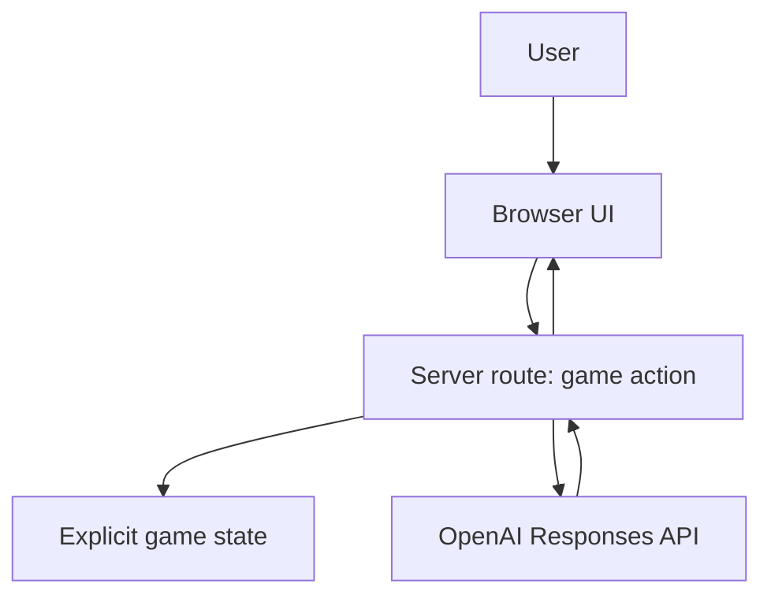

# Architecture Overview

## Goal

Build a tiny web game where the user thinks of a famous person and the AI tries to guess them within 21 yes/no questions.

## MVP architecture

## State model

Keep these fields explicit in app/server state:

- `gameId`
- `phase`: `intro | asking | guessing | result`
- `questionCount`
- `maxQuestions`: `21`
- `transcript`: ordered question/answer turns
- `latestQuestion`
- `finalGuess`
- `result`: `unknown | correct | incorrect | gave_up`

The model may reason about the game, but the app owns the rules.

## Server responsibilities

- Hold `OPENAI_API_KEY` server-side only.
- Call the Responses API with the official OpenAI JS SDK.
- Ask for structured JSON output from the model.
- Enforce that the AI asks only one yes/no-compatible question per turn.
- Enforce the 21-question limit independent of model behavior.

## Browser responsibilities

- Start/reset game.
- Display the current question and count.
- Let the user answer with buttons: Yes, No, Maybe / Not sure.
- Display transcript and final guess.

## Later extensions

- Realtime voice mode using `gpt-realtime-2`.
- Shareable result cards.
- Difficulty modes: famous people, fictional characters, founders/builders, animals/objects.
- Optional Image Gen reward card after the final guess.
